<p align="center">
  <picture>
    <source media="(prefers-color-scheme: dark)" srcset=".github/readme/wordmark-dark.svg">
    
  </picture>
</p>

<h3 align="center">Publish a website from the harness you already have open.</h3>
<p align="center"><em>Your CMS is wherever your agent is.</em></p>

<p align="center">
  <a href="https://github.com/snymrova/snypd/actions/workflows/bench.yml"></a>
  <a href="https://www.npmjs.com/package/@snypd/cli"></a>
  <a href="LICENSE"></a>
  <a href="bench/page.md"></a>
  <a href="docs/04-runtime-and-renderer.md"></a>
</p>

A CMS your agent can actually use — markdown in your repo, static HTML out, zero JS. Snypd's **only interface is MCP**: you write, edit, theme and publish a site from Claude Code, Cursor or Codex, and nothing here has a dashboard. Content is markdown + YAML in a git repo you own; the product is one Bun binary; the output is static HTML with no JavaScript by default, and every chart, diagram and flow on the page is SVG the build wrote.

<!-- video: V1, the hero — one sentence into Claude Code, a site, a post, a build. Real session, waits folded. Sunny drops v1.mp4 here; until then the poster below. -->
<p align="center">
  <a href=".github/readme/looks/editorial-paper-light.png">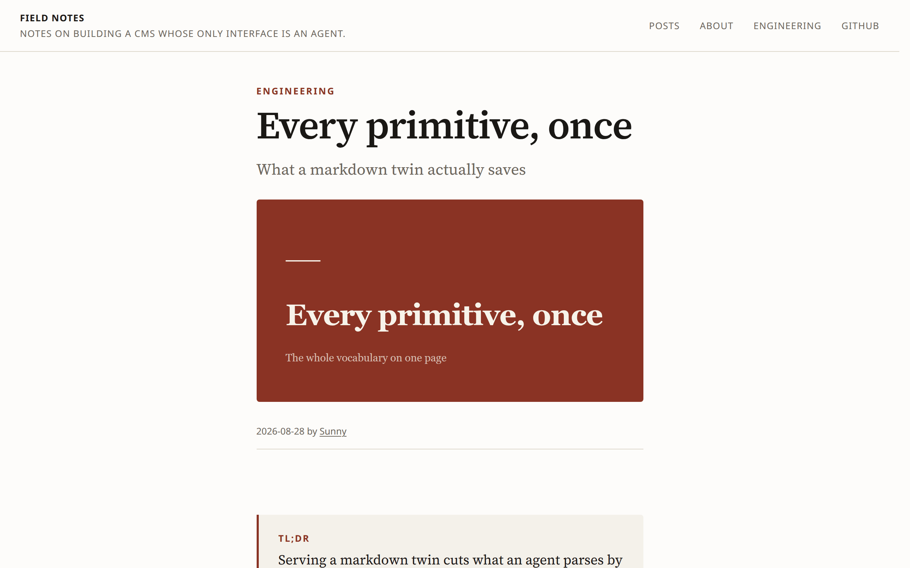</a>
</p>

## Start here

Paste this into the harness you already have open:

> Set up snypd here and write me a first post. Ask me what the site is called, then run `bunx @snypd/cli init`.

That is the whole front door. The agent asks what the site is called, runs `init`, and relays the one thing it cannot do — restart the harness so the tools load. On the far side it picks up from `initialize`, reads the site and writes the post ([docs/08](docs/08-first-run.md)). `npm i -g @snypd/cli` puts `snypd` on your `PATH` on macOS (Apple silicon and Intel), Linux (x64 and arm64) and Windows (x64) — one ~85 MB binary, [published from CI with provenance](packaging/).

## What you get

- **One binary.** The MCP server, the renderer, the spec, the bundled themes and plugins, SQLite — `snypd`, seven verbs, none of which writes content.
- **Zero JavaScript by default.** `page.js.kb` is 0 on every route of every shipped theme, and the build refuses a page that breaks it ([bench/page.md](bench/page.md), [docs/11 decision 121](docs/11-hardening-and-themes.md)).
- **Thirteen typed primitives, rendered at build time.** A `chart` is inline SVG; a `flow` is a laid-out graph; a `stat` without a source fails lint.
- **The agent-read surface, on every build.** A `.md` twin beside every page, `llms.txt`, `feed.xml`, `sitemap.xml`, a JSON API, JSON-LD — 8/8 ([bench/latest.md › surface](bench/latest.md)).
- **Benchmarks that fail CI.** Build speed, cold start, tokens, bytes, axe violations, a live-model kill test — every number in this file links to its row.
- **A git repo you own.** Every CMS claims no lock-in. This is the only one where you can check it with `ls`: markdown and YAML, in your repo, rendered by a binary you have a copy of.

<p align="center">
  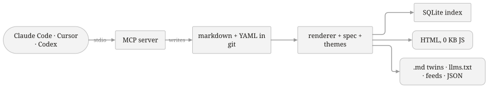<br>
  <sub>This diagram is snypd's own <code>diagram</code> primitive, rendered by the build from <a href="corpora/readme/content/posts/one-binary.md">twelve lines of YAML</a>. No coordinates were typed.</sub>
</p>

## Thirteen primitives

The vocabulary is closed on purpose: thirteen blocks, versioned, each with a schema, an intent, an anti-intent and a fallback ([docs/01](docs/01-content-and-primitives.md), [`packages/spec/primitives/`](packages/spec/primitives/)). Themes implement the vocabulary; content never references a theme. Left, the spec's own example; right, the `editorial` theme rendering it.

<!-- primitives: generated by packages/bench/readme/primitives.ts — edit the spec, not this -->
<table>
<tr>
<td valign="top" width="46%"><strong><code>cover</code></strong> — The post header — title block with optional eyebrow, subtitle and image.<pre><code>::cover{eyebrow="Engineering" subtitle="What a markdown twin actually saves" image="/media/cover.png" alt="Token counts side by side"}</code></pre></td>
<td valign="top" width="54%">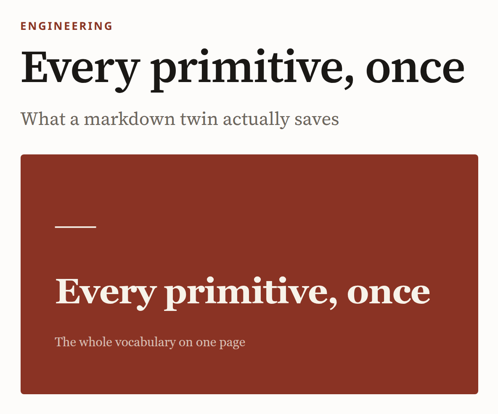</td>
</tr>
<tr>
<td valign="top" width="46%"><strong><code>tldr</code></strong> — The 1–3 sentence summary an agent or skimmer reads first.<pre><code>:::tldr&#10;Serving a markdown twin cuts what an agent parses by 92 %. `llms.txt` may do nothing.&#10;:::</code></pre></td>
<td valign="top" width="54%">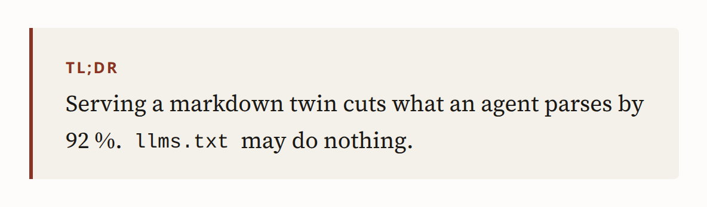</td>
</tr>
<tr>
<td valign="top" width="46%"><strong><code>callout</code></strong> — A boxed aside that must not be skipped — a warning, a tip, a note, or a line you want quoted.<pre><code>:::callout{kind="warning" title="The caveat"}&#10;`llms.txt` is the most-recommended and least-evidenced item on the list.&#10;:::</code></pre></td>
<td valign="top" width="54%">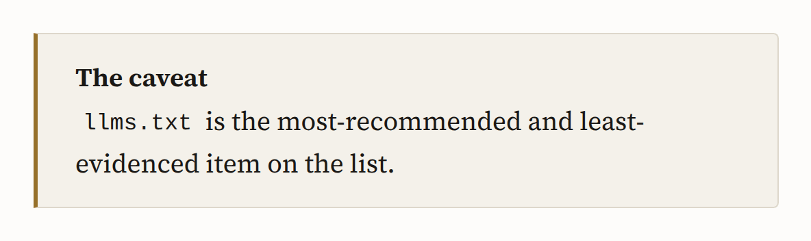</td>
</tr>
<tr>
<td valign="top" width="46%"><strong><code>pullquote</code></strong> — A sentence lifted from the text (or a cited source) and set large.<pre><code>:::pullquote{cite="Google Search Central" href="https://developers.google.com/search"}&#10;There is no ranking benefit from llms.txt.&#10;:::</code></pre></td>
<td valign="top" width="54%"></td>
</tr>
<tr>
<td valign="top" width="46%"><strong><code>stat-row</code></strong> — Two to four stats side by side, the numbers a post stands on.<pre><code>:::stat-row&#10;::stat{value="92%" label="fewer tokens" source="https://snypd.rocks/bench"}&#10;::stat{value="0" label="Google support for llms.txt" source="https://developers.google.com/search"}&#10;:::</code></pre></td>
<td valign="top" width="54%">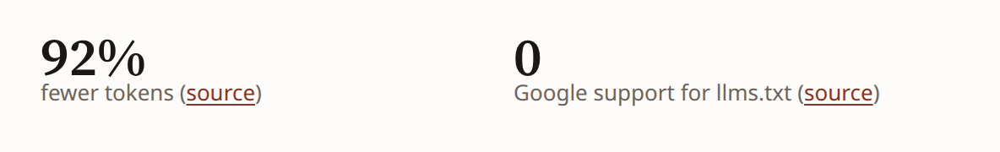</td>
</tr>
<tr>
<td valign="top" width="46%"><strong><code>stat</code></strong> — One number with its label and where it came from.<pre><code>::stat{value="92%" label="fewer tokens" source="https://snypd.rocks/bench"}</code></pre></td>
<td valign="top" width="54%">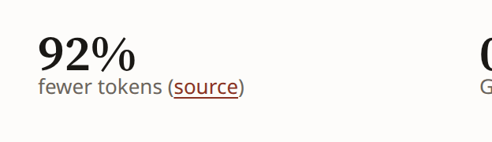</td>
</tr>
<tr>
<td valign="top" width="46%"><strong><code>chart</code></strong> — A small static chart rendered to inline SVG at build time from inline data or a YAML file.<pre><code>:::chart{type="bar" source="https://snypd.rocks/bench" caption="Tokens per page, HTML vs markdown twin" unit="tokens"}&#10;- { label: HTML, value: 6120 }&#10;- { label: Markdown twin, value: 504 }&#10;:::</code></pre></td>
<td valign="top" width="54%">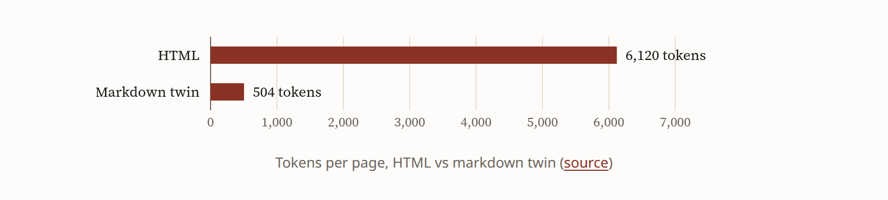</td>
</tr>
<tr>
<td valign="top" width="46%"><strong><code>diagram</code></strong> — A box-and-arrow diagram laid out automatically (layered, deterministic) and rendered to inline SVG at build time.<pre><code>:::diagram{direction="lr" caption="Content flows from git to two outputs."}&#10;nodes:&#10;  - { id: md, label: markdown + YAML }&#10;  - { id: build, label: snypd build }&#10;  - { id: html, label: HTML }&#10;  - { id: twin, label: .md twin }&#10;edges:&#10;  - { from: md, to: build }&#10;  - { from: build, to: html }&#10;  - { from: build, to: twin }&#10;:::</code></pre></td>
<td valign="top" width="54%"></td>
</tr>
<tr>
<td valign="top" width="46%"><strong><code>flow</code></strong> — An ordered procedure with branches — steps plus yes/no decisions — written as YAML and rendered as a diagram.<pre><code>:::flow{caption="Publishing lands one item on main; the agent never checks main out."}&#10;steps:&#10;  - Draft on snypd/drafts&#10;  - Run lint&#10;  - ask: Lint clean?&#10;    yes: Open preview&#10;    no: { then: fix }&#10;  - id: fix&#10;    do: Fix the reported rule and re-lint&#10;  - Human approves&#10;  - Land that one item on main&#10;:::</code></pre></td>
<td valign="top" width="54%">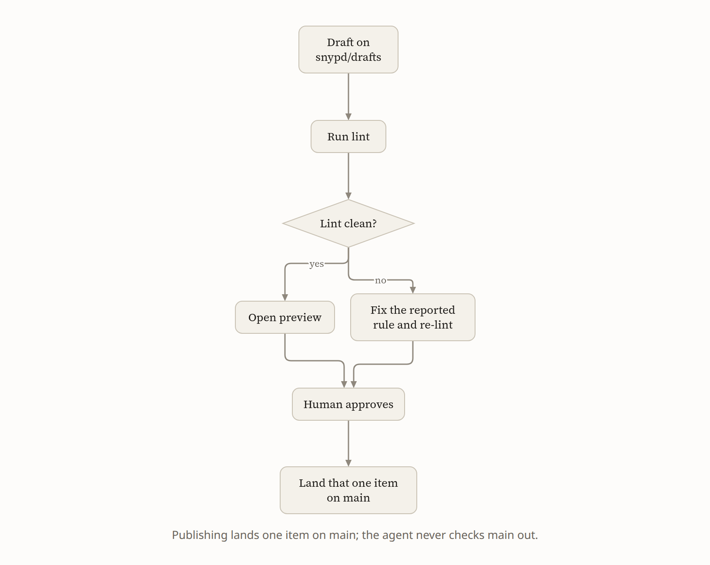</td>
</tr>
<tr>
<td valign="top" width="46%"><strong><code>steps</code></strong> — An ordered procedure, emitted as HowTo schema.<pre><code>:::steps{title="Add a markdown twin" time="5 min"}&#10;1. **Build** — `snypd build` writes `index.md` beside every `index.html`.&#10;2. **Serve** — answer `Accept: text/markdown` with the twin.&#10;3. **Verify** — `curl -H 'Accept: text/markdown' https://example.com/post/`.&#10;:::</code></pre></td>
<td valign="top" width="54%">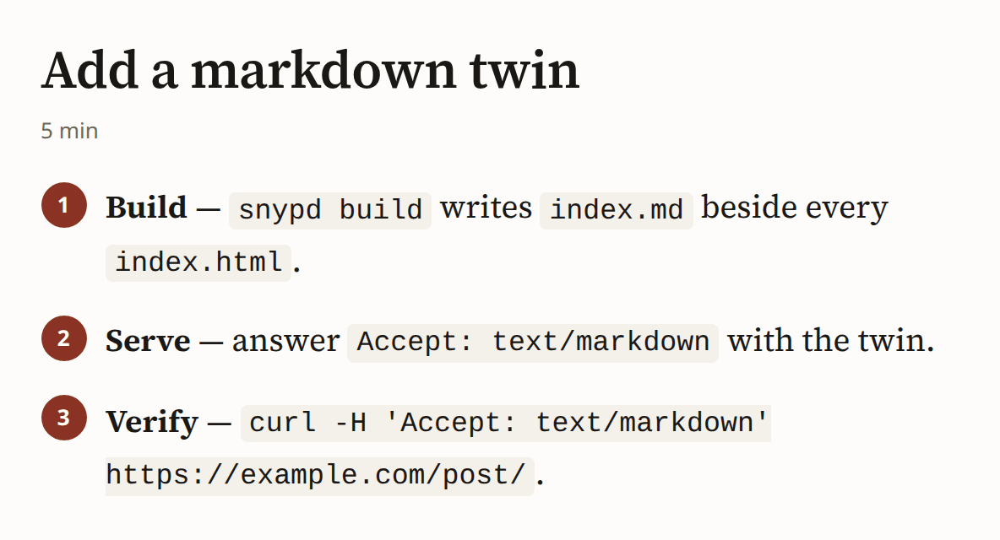</td>
</tr>
<tr>
<td valign="top" width="46%"><strong><code>faq</code></strong> — Question-and-answer pairs, emitted as FAQPage schema.<pre><code>:::faq&#10;### Does llms.txt help ranking?&#10;No. No search engine has announced support.&#10;&#10;### What does help?&#10;A markdown twin served on `Accept: text/markdown`.&#10;:::</code></pre></td>
<td valign="top" width="54%">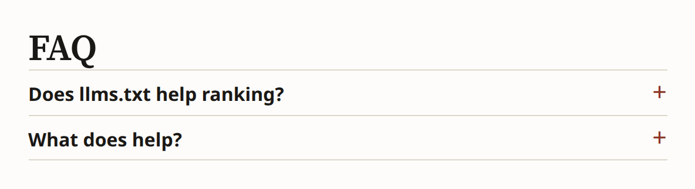</td>
</tr>
<tr>
<td valign="top" width="46%"><strong><code>figure</code></strong> — An image with mandatory alt text and an optional caption; the only way to place an image.<pre><code>::figure{src="/media/twin.png" alt="Side-by-side HTML and markdown of the same post" caption="The `.md` twin is the source file." width="wide"}</code></pre></td>
<td valign="top" width="54%">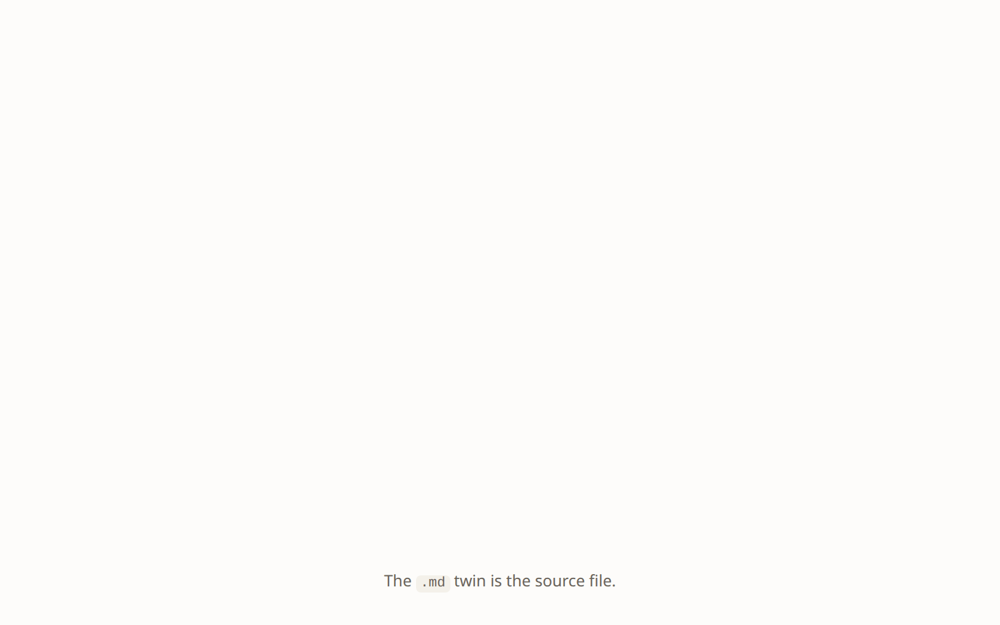</td>
</tr>
<tr>
<td valign="top" width="46%"><strong><code>cta</code></strong> — One call to action — a title, a line of body and a single button.<pre><code>::cta{title="Run the bench yourself" body="One binary, one command." button="Install" href="https://snypd.rocks/install"}</code></pre></td>
<td valign="top" width="54%">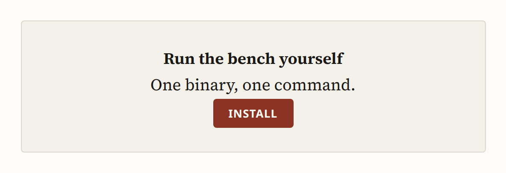</td>
</tr>
</table>
<!-- /primitives -->

## Three themes, six looks

The same post, photographed in every look the shelf carries. Each look is measured before it is photographed — JavaScript on the wire, the webfont against its own budget, axe violations at 1280 and 390 px ([bench/gallery.md](bench/gallery.md), live at [snypd.rocks/themes](https://snypd.rocks/themes/)).

<table>
<tr>
<td width="50%"><picture><source media="(prefers-color-scheme: dark)" srcset=".github/readme/looks/editorial-paper-dark.png"></picture><br><strong>editorial › paper</strong> — warm cream, oxblood accent, serif throughout. <sub>0 KB JS · 30.4 KB font · 0 axe</sub></td>
<td width="50%">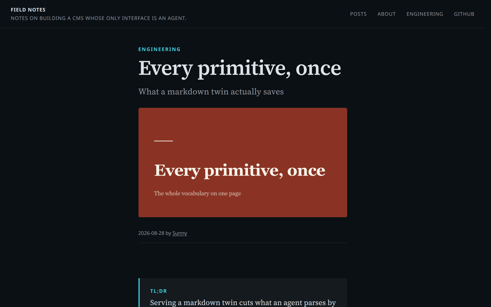<br><strong>editorial › ink</strong> — dark only: a cool near-black, one cyan, the same measure. <sub>0 KB · 30.4 KB · 0</sub></td>
</tr>
<tr>
<td><picture><source media="(prefers-color-scheme: dark)" srcset=".github/readme/looks/editorial-broadsheet-dark.png">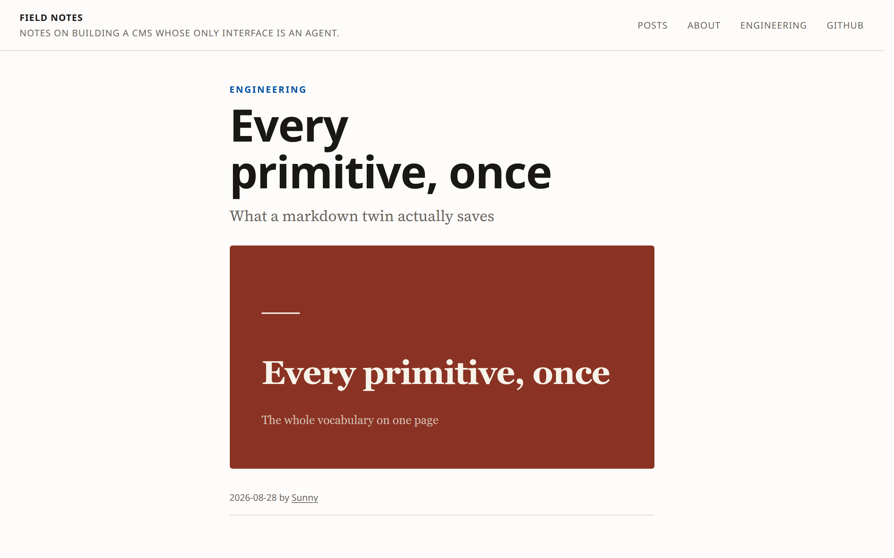</picture><br><strong>editorial › broadsheet</strong> — a wider column, sans headlines, tighter leading, a press blue. <sub>0 KB · 30.4 KB · 0</sub></td>
<td><picture><source media="(prefers-color-scheme: dark)" srcset=".github/readme/looks/technical-graphite-dark.png">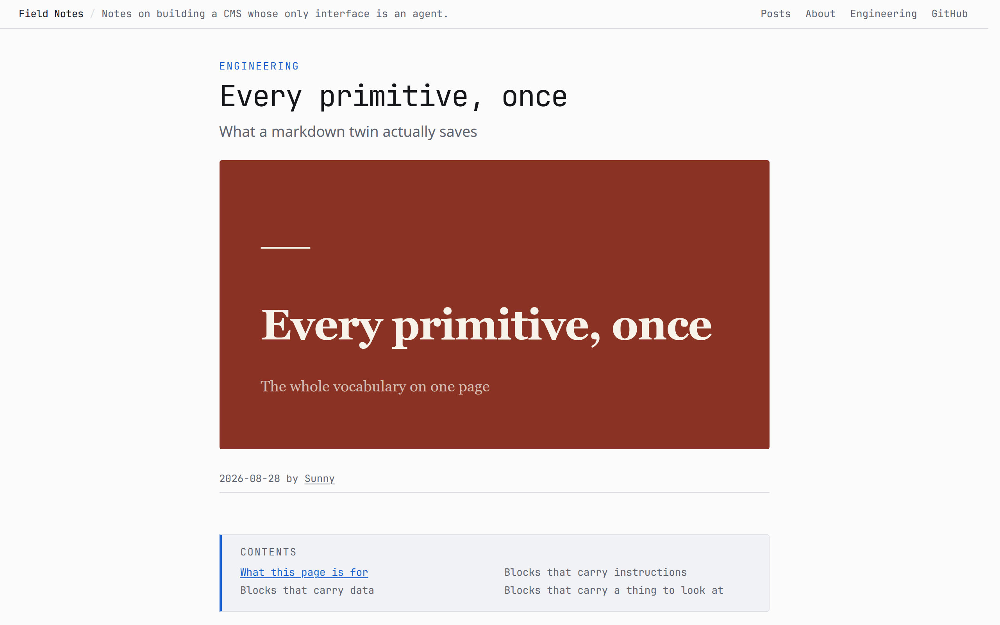</picture><br><strong>technical › graphite</strong> — cool neutral, one blue, mono headings, follows the reader's scheme. <sub>0 KB · 0 KB · 0</sub></td>
</tr>
<tr>
<td>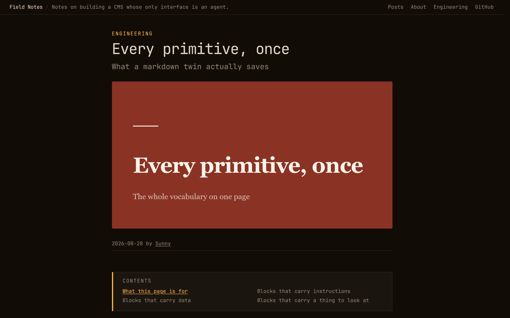<br><strong>technical › phosphor</strong> — dark only: amber on near-black, mono throughout. <sub>0 KB · 0 KB · 0</sub></td>
<td><picture><source media="(prefers-color-scheme: dark)" srcset=".github/readme/looks/base-dark.png">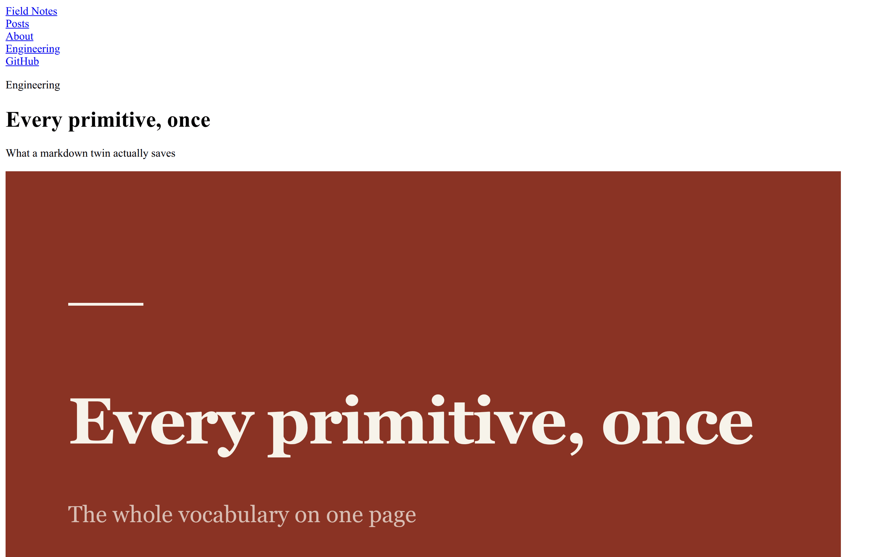</picture><br><strong>base</strong> — unstyled. Semantic HTML, one class per primitive, all five layouts; every theme extends it. <sub>0 KB · 0 KB · 0</sub></td>
</tr>
</table>

<p align="center">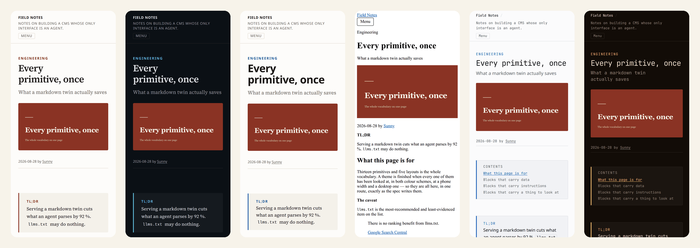</p>

### Write a theme

A theme is the one artefact that is not content, so it is the one thing a terminal makes: `snypd new theme slate` writes a `theme.yaml` and one stylesheet, and `base` brings every layout and all thirteen primitives. A theme may declare tokens, named looks (`variations`), settings a site can flip, and **one webfont** — self-hosted, subsetted, ≤ 40 KB, with a metric-matched fallback. `snypd check theme` is the judge, and it is what [snypd.rocks/themes](https://snypd.rocks/themes/) runs before it lists anything: seventeen named rules, including the WCAG ratio of every colour pair on every look the theme ships. Or ask your agent — the `build-theme` prompt walks it through the same eight steps.

<p align="center">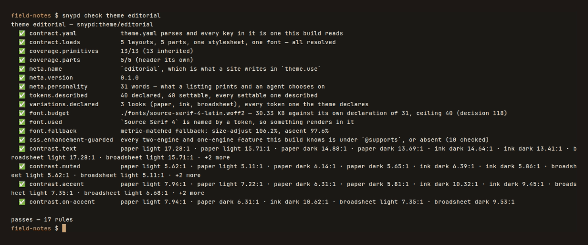</p>

## The MCP surface

Small on purpose. `tools/list` is `content.*` plus `find_tools`, which hands over theming, config and the bench when asked — **2 230 tokens a turn**, and a whole site costs an agent under 6 000 tokens to learn ([bench/latest.md › tokens](bench/latest.md), [docs/03](docs/03-mcp.md)).

| | |
|---|---|
| **Resources** | `snypd://config` · `snypd://spec/primitives` · `snypd://types` · `snypd://theme` (tokens, variations, settings, coverage) · `snypd://themes` · `snypd://plugins` · `snypd://nav` · `snypd://bench/latest` |
| **Tools** | `content.create` · `update` · `lint` · `publish` · `set_status` · `query` · `render_preview` · `suggest_blocks` · `explain` · `trash` · `restore` · `find_tools` → `site`, `theme`, `bench`, and one tool per plugin |
| **Prompts** | `get-started` — reads what the site already is and takes it from there · `write-post` · `build-theme` |

Tested against live models, not mocks: the kill test passes **15/15** on haiku, sonnet and opus ([bench/agent.md](bench/agent.md)), and a first-attempt post lints clean **70 % / 95 % / 95 %** of the time over twenty topics ([bench/writes.md](bench/writes.md)).

## A person in the loop

By default an agent drafts, publishes and pushes. A site puts a person back in the loop per type (`mcp.write: draft` — the agent stops at a review URL and a person approves that exact version) or per deploy (`deploy.push: human` — the one button on the Desk). Writes land on a `snypd/drafts` branch; a build of that branch is a `noindex` preview; publishing lands one item on `main`. `snypd dev` is the one verb aimed at a person: it serves what a build already produced and writes nothing.

<p align="center">
  <picture><source media="(prefers-color-scheme: dark)" srcset=".github/readme/desk/desk-dark.png">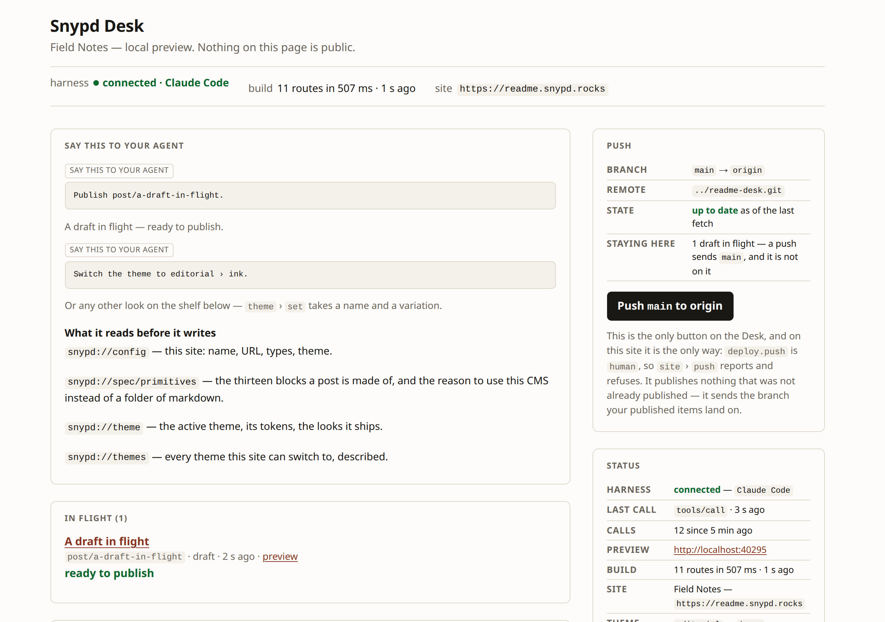</picture><br>
  <sub>The Desk at <code>/_snypd</code>: what to say to your agent, computed from the site's state; a draft in flight; the push, gated.</sub>
</p>

## Plugins

A plugin is a directory with a `snypd.yaml`. Four ship in the binary, one per tier — `changelog` (a `release` type and a `product` taxonomy, no code), `analytics` (a slot and a 3 KB client budget), `autolink` (a transform over every document's tree), `indexnow` (reacts to `publish` and `push` through a fetch that reaches only the hosts it names). A plugin can also carry tools: one tool named after the plugin, verbs as actions, found through `find_tools` so the per-turn cost never moves. The contract is **experimental through 0.x** ([docs/10 §4](docs/10-plugins-and-launch.md)); a plugin is code you install and vet like any dependency, and nothing here is a sandbox.

```yaml
plugin:
  name: changelog
  version: 0.1.0
  api: 1
  description: A `release` type and a `product` taxonomy — a changelog at /changelog/{slug}, no code.
types:
  release: { extends: post, dir: content/changelog, urlPattern: /changelog/{slug}, taxonomies: [product] }
```

## Speed

<p align="center">
  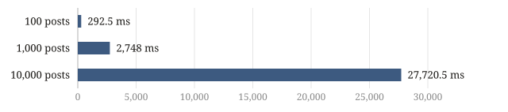<br>
  <sub>The chart is snypd's own <code>chart</code> primitive, drawn by the build from rows read out of <a href="bench/latest.md">bench/latest.md</a> — CI's record, 4 vCPUs.</sub>
</p>

| | | |
|---|---|---|
| **2.7 ms a page** | a cold build, no `dist/`, no index — 2 748 ms for 1 000 posts, 27.7 s for 10 000 | [`build.cold.*`](bench/latest.md) |
| **13 ms** | one edit, rebuilt: 1 page rendered, 123 cached | [`build.incremental.100`](bench/latest.md) |
| **23 ms** | spawn to `initialize` on the release binary, so the agent's first turn does not wait | [`mcp.coldStart.binary`](bench/latest.md) |
| **510 tokens** | to read one page as its markdown twin | [`tokens.page.md`](bench/latest.md) |

Every row has a budget, CI passes at 80 % of it, and [snypd.rocks/bench](https://snypd.rocks/bench/) is generated from the same file.

## Deploy

`snypd init --deploy=cloudflare` (or `vercel`) writes the host's half — a build command that is `snypd build` and a `dist/` — and a GitHub workflow that installs one pinned version and runs it. The host watches the repo; snypd never talks to it. A custom domain is never behind a paywall, because there is no paywall in the binary.

## Who it is for

Solo founders and small technical teams who already write in a harness and resent the CMS tab. Agencies running five to twenty client sites from one workspace: one binary, twenty git repos, $0. Not marketing teams who live in Notion — there is no dashboard, and there will never be a visual designer ([docs/11 decision 145](docs/11-hardening-and-themes.md)).

**WordPress for the agent era**, precisely: kept post types, taxonomies, hooks, themes, child themes and a plugin directory; refused the database, the dashboard, the registry, the priorities, and every byte of default JavaScript.

<details>
<summary><strong>Every verb</strong></summary>

```
snypd init [root] [--name=…] [--url=…] [--deploy=cloudflare|vercel]   scaffold a site and register it with your harness
snypd dev [root]                                                      the Desk and the site with drafts in it, for a person
snypd serve [root]                                                    MCP on stdio — what your harness spawns, not what you type
snypd build [root] [--drafts]                                         content → dist/; --drafts is a noindex preview
snypd bench [agent|writes|gallery|report|onboard|page|visual|suggest]  the suites → bench/*.md
snypd new theme|plugin <name> [--extends=base]                        scaffold one, in themes/ or plugins/
snypd check theme|plugin [name] [--all]                               judge one by rule — what the shelf runs
```

From a checkout: `bun install`, then `bun run snypd <verb>`; `bun test`; `bun run release` builds the five platform packages; `bun run scratch` makes a real site in `sites/` wired to this tree. The package is scoped and the command is not — npm declined the bare `snypd` as too close to `snyk` — so `npm i -g @snypd/cli` still puts **`snypd`** on your `PATH`.
</details>

<details>
<summary><strong>The plugin contract</strong></summary>

The root of a plugin's `snypd.yaml` merges into the site's config (types, taxonomies, budgets); the `plugin:` block is the manifest — name, version, `api: 1`, an options schema the site's entry is validated against, and the capabilities it declares. `plugins: [changelog]` in the site's config enables a bundled one with no install; `plugins/<name>/` in the site or `snypd-plugin-<name>` on npm goes through the same loader. A plugin **declares** (types, taxonomies), **decorates** (six slots, six filters), **transforms** (a `transform` stage over each document's tree, an `emit` stage whose files core writes under the plugin's own prefix), **reacts** (`publish` and `push` events, fire-and-report), and **speaks** (one tool, verbs as actions, and prompts). `snypd://plugins` and `site` › `doctor` print all of it. A transform changes the page and never the `.md` twin — the twin is the source, byte for byte.
</details>

<details>
<summary><strong>The pictures in this file</strong></summary>

Every image here was made by the tree, not by hand: [`corpora/readme`](corpora/readme/) is a fixture like the bench's, [`packages/bench/readme/`](packages/bench/readme/) photographs it through the same headless Chrome the gallery lane uses, the two SVGs are the build's own output, the wordmark is set from the theme's own webfont, and the terminal is a recording. [`.github/readme/manifest.json`](.github/readme/manifest.json) names every frame's look, route, viewport and scheme. [docs/15](docs/15-readme.md) is the plan.
</details>

---

Design set: [`docs/`](docs/) — the answer to "why is it like this" · Site: [snypd.rocks](https://snypd.rocks) · [Themes](https://snypd.rocks/themes/) · [Plugins](https://snypd.rocks/plugins/) · [Benchmarks](https://snypd.rocks/bench/) · [Contributing](CONTRIBUTING.md) · [Security](SECURITY.md) · MIT ([LICENSE](LICENSE))
